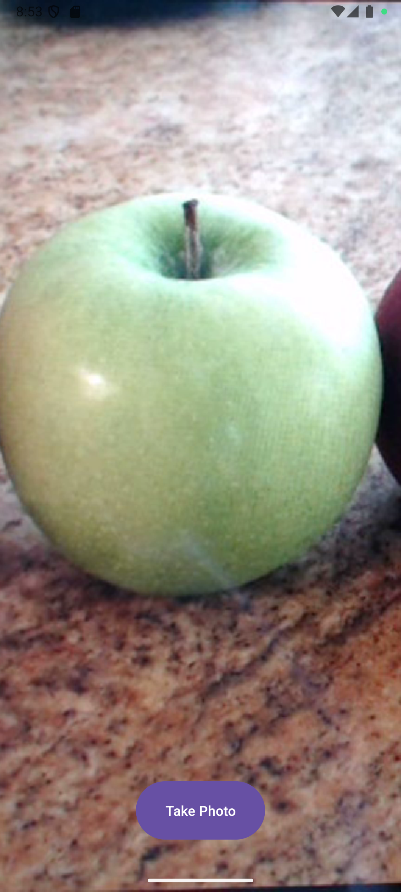
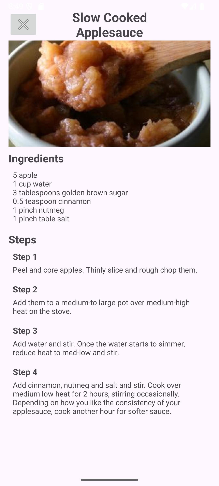

# What Can I Make With This
This app helps users identify ingredients using their camera and find recipes based on those ingredients. The app utilises CameraX for image capture, ML Kit for ingredient classification, and Spoonacular API for recipe information.

## Features
- Classifies an image in the background, while the user reviews their image
- Fetches relevant recipes and details using Spoonacular API.

## Overview
### Ingredient Capture
Take a picture of an ingredient. When displaying it, I noticedI noticed that it would always be rotated. I found that this was due to the image's EXIF data.

### Finding Recipes
The ingredient classified is added to the list. Users can add more via text or camera. Spoonacular API was used to get a list of recipes using the ingredients listed.

### Recipe Details
Clicking on a recipe brings up the recipe in detail, showing an image, ingredients and steps.
